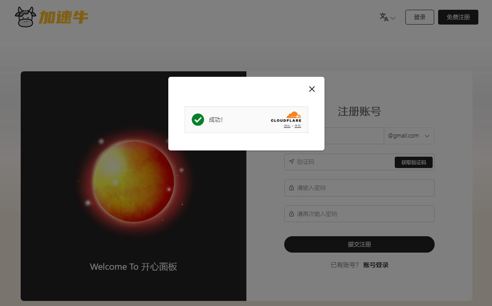

# v2board-theme-kxboard
基于v2board面板的主题，前后端分离，防墙去特征、不怕墙、体积超小的免费主题，支持 V2B/XB，
- **主题1预览：https://demo1.kxboard.xyz**
- **主题2预览：https://demo2.kxboard.xyz**
- **交流群组** : [**https://t.me/kxBoard**](https://t.me/kxBoard)

## 主题信息

*   主题名称 ：**开心面板主题**
*   主题版本 ：**1.0.1**
*   更新日期 : 2024/10/06
*   环境兼容 : [**v2board**](https://github.com/wyx2685/v2board) / [**xboard**](https://github.com/cedar2025/Xboard)
*   主题特性 : 前后端分离、加载速度快、体积小、防墙、去特征
*   主题价格 : **永久开源免费**
*   预览账号 : test1@gmail.com / 12345678

## 主题特色
#### 1、发送注册邮件的时候，增加Cloudflare Turnstile验证

#### 2、优化购买页面，并增加折扣码倒计时的显示

#### 3、优化购买页面，并增加折扣码倒计时的显示

#### 4、佣金提现页面增加提现金额，用户输入的提现金额直接增加到工单内容里

#### 5、优化工单页面，并增加发送表情包和发送图片功能

#### 6、增加crisp的开关控制图片

